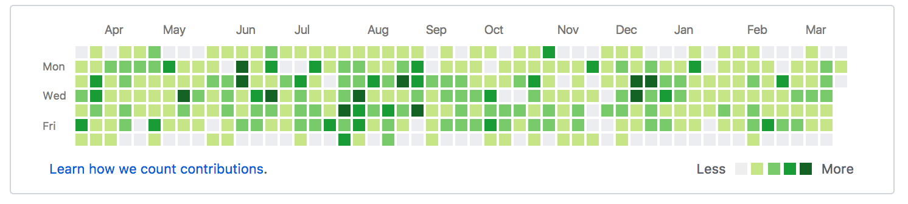

# Charlotte Junior Devs Challenges
Collection of solved challenges are hosted here. Our [meetups](https://www.meetup.com/charlottejuniordevs) will frequently go over the challenges listed here.

## Why use this repo for challenges instead of a site like exercism.io?
Having challenges hosted on this repository will encourage users to use GitHub and gain valuable experience using [git](https://git-scm.com/). Also, challenges are solved by forking this repository, submitting a [Pull Request](https://help.github.com/articles/about-pull-requests/) and receiving a code review before being merged. Besides all of the above being great experience for a developer, it adds a code portfolio on GitHub and also makes a profile look closer to looking like this (definitely not a requirement, but it signals that you are a developer with actively maintained skills):

## How is this repo organized?
Only working solutions from past challenges are merged into the `master` branch.  Each directory is named after its corresponding challenge and solutions from different users are located inside.

## Where can I find the complete list of challenges?
Challenges are listed as [issues](https://github.com/charlottejuniordevs/challenges/issues?q=is%3Aissue). Feel free to peruse through them!

## Can I request a challenge?
Absolutely!  All contributions welcome. If you have a challenge that you think would be useful to other developers, please feel free to [create a new issue](https://github.com/charlottejuniordevs/challenges/issues/new).

If you just have a question that you'd like help with, our slack channel at https://charlottejuniordevs.slack.com is the best place to ask questions and get help.
If you need an invite, go to https://charlottejuniordevs.herokuapp.com/.

## How do I submit a solution to a challenge?
Completed challenges can be submitted by [forking](https://help.github.com/articles/fork-a-repo/) this repo and making a [pull request](https://help.github.com/articles/about-pull-requests/). See [CONTRIBUTING.md](./CONTRIBUTING.md) for more detailed instructions.
